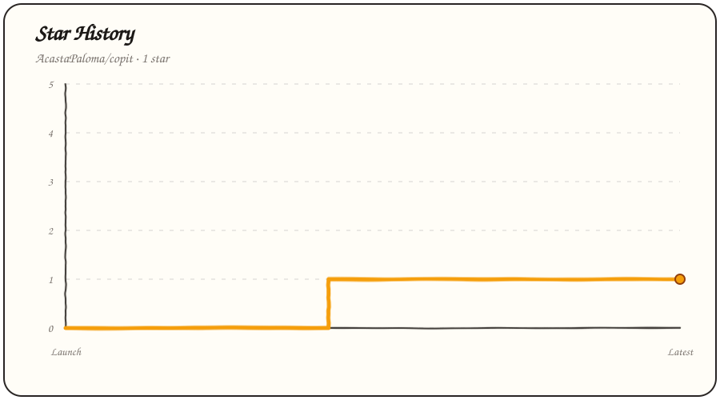

<p align="center">
  <a href="https://github.com/AcastaPaloma/copit/stargazers">
    
  </a>
</p>

# Copit

Copit is a macOS screenshot tool that lets you select a region, identifies the
visible applications, generates a short image description, and renames the
screenshot automatically.

## Usage

Run Copit in a terminal:

```sh
copit
```

Press <kbd>Command</kbd>+<kbd>`</kbd> to open the selector. Press
<kbd>Escape</kbd> to cancel before or during a drag.

The first run downloads `HuggingFaceTB/SmolVLM-256M-Instruct` into the standard
Hugging Face cache. Keep the terminal open when running Copit this way.

## Run automatically at login

Homebrew can run Copit as a background user service:

```sh
brew services start copit
```

The service starts immediately, launches automatically when you log in, and
remains active while the laptop sleeps and wakes. Manage it with:

```sh
brew services restart copit
brew services stop copit
```

Service output is written to `$(brew --prefix)/var/log/copit.log` and errors to
`$(brew --prefix)/var/log/copit.error.log`.

## macOS permissions

When running in a terminal, the terminal application needs these permissions.
When running as a service, macOS may list the Homebrew Python process instead:

- Accessibility permission for the global hotkey.
- Input Monitoring permission for the global hotkey.
- Screen Recording permission for screenshots.

Configure these under **System Settings → Privacy & Security**.

## Python development install

```sh
python3 -m venv .venv
./.venv/bin/python -m pip install -e .
./.venv/bin/copit --version
```

## Homebrew

The repository includes a tap-ready formula and a release checklist in
[`Formula/README.md`](Formula/README.md).
